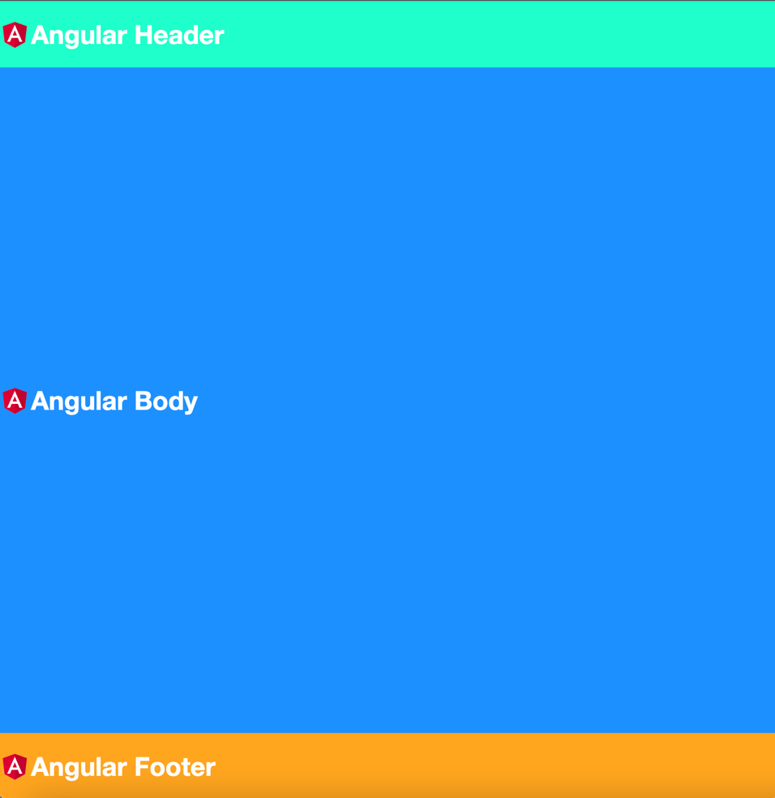

👋 Welcome to this guide on implementing micro-frontends using web components and Angular! Here's a brief overview of how it works and the theory behind it:

Web Components are custom, reusable HTML tags that allow us to create independent components across different frameworks and platforms. By creating Web Components from Angular applications, we can use them as micro-frontends.

To containerize the micro-frontends, we create an app-shell which serves as a common interface for communication and navigation between the micro-frontends.

🎉 By using Web Components and an app-shell, we can create scalable and flexible solutions for building complex web apps! 🚀
## Final Result

